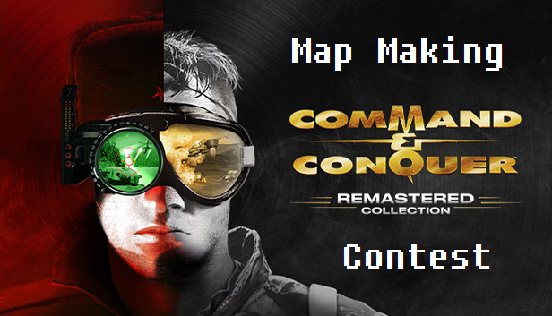

# C&C TD Remastered Map Making Competition July 2021

## Prizes

These will be fulfilled and paid by Danku via PayPal transfer.

🥇 <b>1st Place - 20$</b>  
🥈 <b>2nd Place - 10$</b>

## Judges
* Achromic White
* Lovehandles
* Mclama
* FeRReT666 / BlueMouse420
* Danku

## Deadline
Maps must be uploaded to the steam workshop and accessible in-game by <b>Friday 30th July 2021</b>.  
Submissions will be listed under the Submissions section once received.

There will be up to 2 weeks deliberation time for judges to announce results.

## Map Requirements

Your map should be designed with the following in mind:

* It will be used as a competitive 1 v 1 map - only 2 spawn points should feature on the map
* Any tileset is fine so long as it is compatible with the base C&C Remastered Tiberian Dawn game
* The design must be of your own making, ports from legacy CnCnet maps are not accepted

You should design your map with the below marking criteria in mind.

## Marking Criteria

Judges will each complete a score sheet for maps submitted, these will be averaged to determine the final map scores.

### Tiberium
* Do both spawn points have equal access to starting tiberium fields/amounts?
* Does one spawn have a mining advantage over another?
* Is there a reasonable amount of tiberium available? Not too much/too little.

### Use of Terrain / Objects
* Creativity and use of physical elements such as walls, village structures, trees, rivers, cliffs and other terrain elements
* Use of non-physical aesthetic elements such as Smudges / Road Markings
* Elements of Realism in map layout i.e. explosion smudges in a pre-damaged town, mirrored maps with different terrain/obstacles i.e. one corner cut off with broken bridge, another with cliffs and trees

### Map Goals / Points of Interest
* Is there a clear focal point for players to aim towards for map control?

This may be a contested tiberium field that may give the owning player an eco advantage, it may be better positioning on some high ground/center of map that gives a player a distinct strategic advantage, it may be capturable neutral buildings players can build off.

### Base Building / Skill Expression
Crawls are an iconic part of the competitive Tiberian Dawn ladder, does your map allow opportunities for players to:

* Crawl in multiple directions
* Take advantage of faction strengths/weaknesses,
* Have a fast/short game, mid game, long/longer game?

## Submission
Have you uploaded your map to the Steam Workshop and verified it is accessible in-game via the user maps option? Excellent, now all you need to do is pass it along to Danku. You can do this by dropping a steam workshop link to your map to him via Discord through any of these channels:

* [DannyDanku Public Discord](https://discord.gg/bsAMEVz9m9)
* Discord via [Direct Message](https://discord.com/users/201761215842615296)

In the event of issues accessing the maps in game, please message Danku directly as it may be viable to send the raw map files for judging purposes.

## Useful References
* Crexis: [Map Ratings](https://www.reddit.com/r/commandandconquer/comments/icae3f/tiberian_dawn_feedback_map_pool_23/)
* Khyira: [C&C TD Map Design & How it Affects Gameplay](https://www.reddit.com/r/commandandconquer/comments/hwqjg6/cc_td_map_design_and_how_it_affects_gameplay/)
* Achromic White: [Understanding Map Design](https://forums.cncnet.org/topic/8062-understanding-map-design/)
* [Maps for Inspiration](https://steamcommunity.com/sharedfiles/filedetails/?id=2202941811)

## Additional Queries
Reach out to Danku via Discord.
